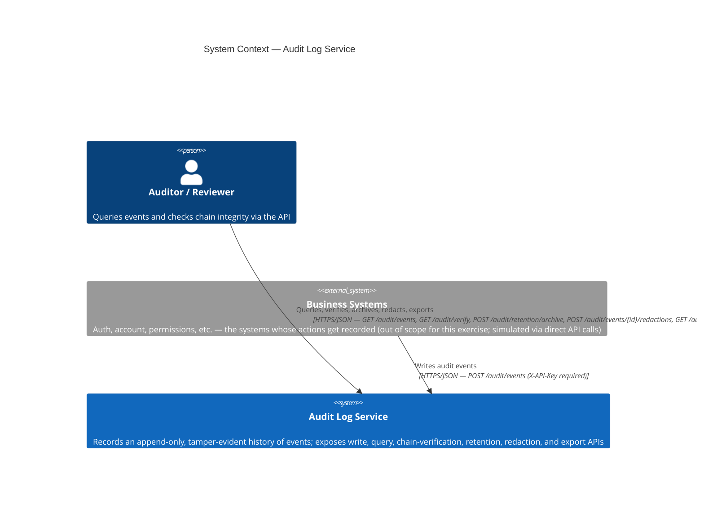
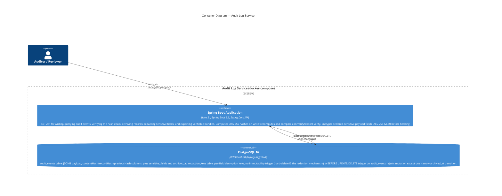

# Audit Log Service — C4 Architecture Diagrams

Reflects the system **as currently implemented** (Scenarios A and B — write
API, query API, hash-chain verification, retention/archival, structured
redaction, bulk export). Scenario C (compliance reporting) is not yet built;
see [`PRD-COMPLIANCE.md`](./PRD-COMPLIANCE.md) for the gap analysis.

Rendered natively by GitHub. To view/edit interactively, paste any block into
https://mermaid.live.

## Level 1 — System Context

## Level 2 — Containers

## Level 3 — Components (inside the Spring Boot Application)

```mermaid
C4Component
    title Component Diagram — Spring Boot Application

    Container_Boundary(api, "Spring Boot Application") {
        Component(authFilter, "ApiKeyAuthFilter", "Servlet Filter", "Gates every /audit/** request behind a static X-API-Key shared secret before it reaches any controller. Actuator/Swagger are exempt.")
        Component(controller, "AuditEventController", "@RestController", "POST /audit/events, GET /audit/events. Returns 405 for PUT/PATCH/DELETE on the events resource.")
        Component(chainController, "AuditChainController", "@RestController", "GET /audit/verify — kept as a separate top-level resource so the path matches the PRD exactly, rather than nesting under /audit/events.")
        Component(redactionController, "RedactionController", "@RestController", "POST /audit/events/{sequenceId}/redactions.")
        Component(retentionController, "AuditRetentionController", "@RestController", "POST /audit/retention/archive.")
        Component(exportController, "AuditExportController", "@RestController", "GET /audit/export, POST /audit/export/verify.")
        Component(exceptionHandler, "GlobalExceptionHandler", "@RestControllerAdvice", "Shared validation/IllegalArgumentException -> 400 handling across all /audit/** controllers.")
        Component(eventService, "AuditEventService", "@Service", "Builds a new AuditEvent, encrypts declared-sensitive payload fields before hashing, looks up the last record for chain linkage, delegates hashing, persists event + redaction keys in one transaction.")
        Component(queryService, "AuditEventQueryService", "@Service", "Builds a composable JPA Specification from actorId/resourceType/resourceId/eventType/from/to/includeArchived and paginates.")
        Component(verifyService, "AuditEventChainVerificationService", "@Service", "Walks the full chain (or last N), recomputes each contentHash/recordHash, and reports the first violation found. Archived records are walked identically to non-archived ones; reports archivedRecordsCount.")
        Component(hasher, "AuditEventHasher", "@Component", "Canonical (fixed-field-order) JSON serialization + SHA-256 for contentHash and recordHash = SHA256(contentHash + previousHash). Unaware of redaction/archival - hashes whatever is in payload/columns as-is.")
        Component(payloadRedaction, "PayloadRedactionService", "@Service", "Encrypts declared-sensitive fields at write time (AES-256-GCM, before hashing); renders payload for reads by decrypting (key present) or substituting [REDACTED] (key destroyed).")
        Component(redactionService, "RedactionService", "@Service", "Redacts a field by hard-deleting its key row; records the redaction itself as a normal FIELD_REDACTED audit event via AuditEventService.")
        Component(retentionService, "AuditEventRetentionService", "@Service", "Bulk-archives (archived_at) records older than a configurable window via a native UPDATE, never an entity save().")
        Component(exportService, "AuditExportService", "@Service", "Builds self-contained export bundles (per-record hashes + manifest hash + HMAC signature) and independently re-verifies previously-exported bundles.")
        Component(fieldEncryptor, "FieldEncryptor", "@Component", "AES-256-GCM encrypt/decrypt with a fresh random key+IV per field per record.")
        Component(hmacSigner, "HmacSigner", "@Component", "HMAC-SHA256 sign/verify for export bundle manifests, using a server-held secret.")
        Component(failureLogger, "AuditEventFailureLogger", "@Service", "Writes validation failures and chain violations back into audit_events as AUDIT_EVENT_WRITE_FAILURE / AUDIT_CHAIN_VIOLATION events, self-referentially auditing the audit log.")
        Component(repository, "AuditEventRepository", "Spring Data JPA + JpaSpecificationExecutor", "Persistence access to audit_events, including the archiveEligible native bulk UPDATE. No entity update/delete methods are exposed.")
        Component(redactionKeyRepository, "RedactionKeyRepository", "Spring Data JPA", "Persistence access to redaction_keys, including delete-by-(sequenceId,fieldPath) - the redaction mechanism itself.")
    }

    ContainerDb(db, "PostgreSQL 16", "audit_events (+ narrowed immutability trigger) + redaction_keys (no trigger)")

    Rel(authFilter, controller, "passes through on valid X-API-Key")
    Rel(authFilter, chainController, "passes through on valid X-API-Key")
    Rel(controller, eventService, "createAuditEvent(request)")
    Rel(controller, queryService, "queryAuditEvents(filters, page)")
    Rel(controller, payloadRedaction, "renderForRead() / renderPage()")
    Rel(chainController, verifyService, "verifyChain(lastN)")
    Rel(redactionController, redactionService, "redactField(sequenceId, fieldPath)")
    Rel(retentionController, retentionService, "archiveEligibleRecords(windowDays)")
    Rel(exportController, exportService, "exportBundle() / verifyBundle()")
    Rel(exceptionHandler, failureLogger, "logValidationFailure() on 400")
    Rel(eventService, payloadRedaction, "encryptSensitiveFields(payload, fields)")
    Rel(eventService, hasher, "computeHash(event, previous)")
    Rel(eventService, repository, "findAll() / save()")
    Rel(eventService, redactionKeyRepository, "saveAll(keys) - same transaction as event insert")
    Rel(payloadRedaction, fieldEncryptor, "encrypt() / decrypt()")
    Rel(payloadRedaction, redactionKeyRepository, "findByIdSequenceId(In)()")
    Rel(redactionService, redactionKeyRepository, "deleteByIdSequenceIdAndIdFieldPath()")
    Rel(redactionService, eventService, "createAuditEvent(FIELD_REDACTED)")
    Rel(retentionService, repository, "archiveEligible(archivedAt, cutoff)")
    Rel(exportService, hasher, "recomputeContentHashOnly() for per-record verification")
    Rel(exportService, hmacSigner, "sign() / verify()")
    Rel(exportService, payloadRedaction, "renderPage() for display payloads")
    Rel(exportService, repository, "findAll(spec, sorted by sequenceId)")
    Rel(verifyService, hasher, "recomputeContentHashOnly() for comparison")
    Rel(verifyService, repository, "findAll(sorted by sequenceId)")
    Rel(verifyService, failureLogger, "log CHAIN_VIOLATION")
    Rel(failureLogger, repository, "save() failure/violation event")
    Rel(queryService, repository, "findAll(spec, pageable)")
    Rel(repository, db, "Hibernate / JDBC")
    Rel(redactionKeyRepository, db, "Hibernate / JDBC")
```

## Key structural decisions visible in the diagrams

- **Two independent immutability layers**: the API layer (405 on
  PUT/PATCH/DELETE) and the database layer (trigger rejecting UPDATE/DELETE
  unconditionally, including direct SQL). Tests exercise tamper-detection by
  disabling the trigger first (`ALTER TABLE ... DISABLE TRIGGER`) — see the
  gap analysis for why this matters for manual validation.
- **Hash chain is two-hash, not one**: `contentHash` covers only the event's
  own fields (tamper-detects the record itself); `recordHash` folds in
  `previousHash` (tamper-detects chain position/ordering). Verification checks
  both independently, which is how it can distinguish `CONTENT_HASH_MISMATCH`
  from `PREVIOUS_HASH_MISMATCH`/`SEQUENCE_GAP`.
- **`AuditEventFailureLogger` writes into the same table it's protecting** —
  validation failures and chain violations become audit events themselves,
  chained like any other record.
- **Redaction never touches `audit_events`.** Sensitive fields are encrypted
  before hashing, so `AuditEventHasher` needed no changes; redaction is a
  hard-delete on a separate `redaction_keys` table with no immutability
  trigger of its own. The redaction action is itself recorded as a normal
  `FIELD_REDACTED` audit event via the same write path as any other event.
- **Archival is a same-table flag, not a physical move.** `archived_at` is
  outside the hash, so the verifier walks archived rows identically to
  non-archived ones — no archive-aware gap-handling logic exists or is
  needed. The immutability trigger allows exactly one narrow transition
  (`archived_at` NULL -> non-null, every other column unchanged).
- **Export bundles carry three independent integrity layers**: per-record
  hash recomputation, a manifest hash over all included record hashes, and
  an HMAC signature over that manifest — so a recipient can detect
  per-record tampering, added/removed/reordered records, and wholesale
  bundle fabrication, respectively.
