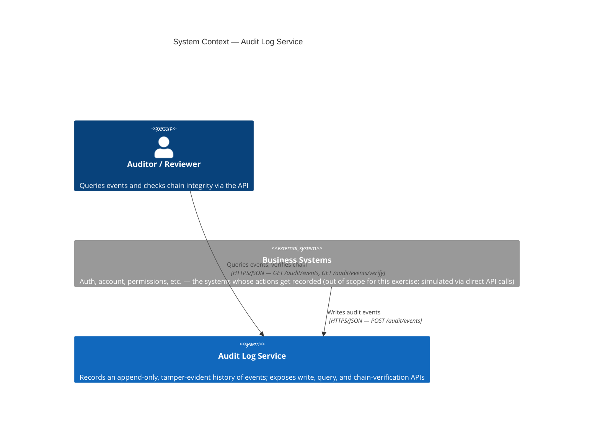
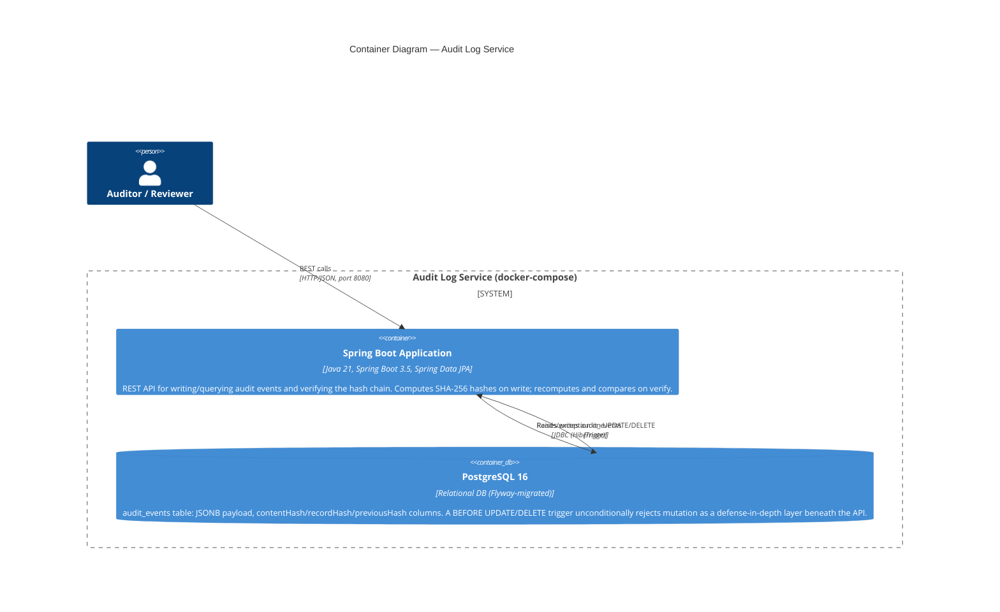
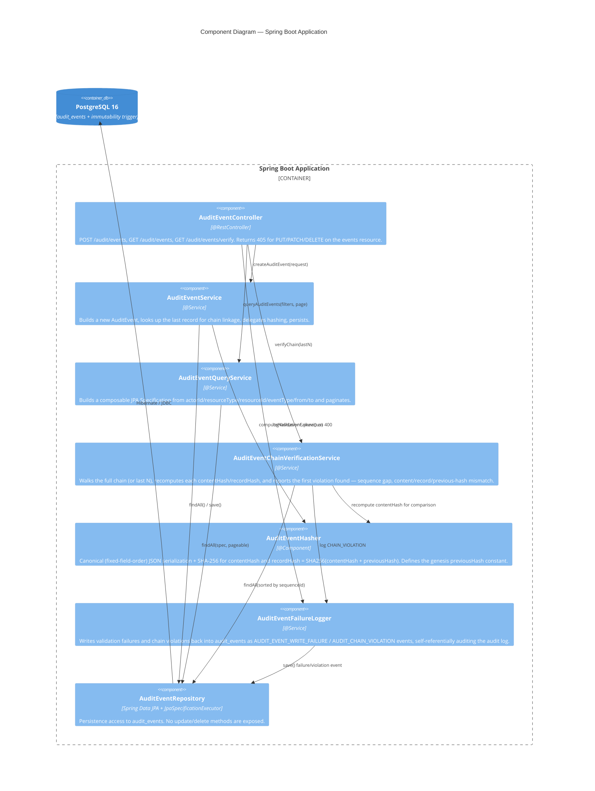

# Audit Log Service — C4 Architecture Diagrams

Reflects the system **as currently implemented** (Scenario A only — write API,
query API, hash-chain verification). Scenario B (retention/redaction/export)
and Scenario C (compliance reporting) are not yet built; see
[`PRD-COMPLIANCE.md`](./PRD-COMPLIANCE.md) for the gap analysis.

Rendered natively by GitHub. To view/edit interactively, paste any block into
https://mermaid.live.

## Level 1 — System Context

## Level 2 — Containers

## Level 3 — Components (inside the Spring Boot Application)

## Key structural decisions visible in the diagrams

- **Two independent immutability layers**: the API layer (405 on
  PUT/PATCH/DELETE) and the database layer (trigger rejecting UPDATE/DELETE
  unconditionally, including direct SQL). Tests exercise tamper-detection by
  disabling the trigger first (`ALTER TABLE ... DISABLE TRIGGER`) — see the
  gap analysis for why this matters for manual validation.
- **Hash chain is two-hash, not one**: `contentHash` covers only the event's
  own fields (tamper-detects the record itself); `recordHash` folds in
  `previousHash` (tamper-detects chain position/ordering). Verification checks
  both independently, which is how it can distinguish `CONTENT_HASH_MISMATCH`
  from `PREVIOUS_HASH_MISMATCH`/`SEQUENCE_GAP`.
- **`AuditEventFailureLogger` writes into the same table it's protecting** —
  validation failures and chain violations become audit events themselves,
  chained like any other record.
